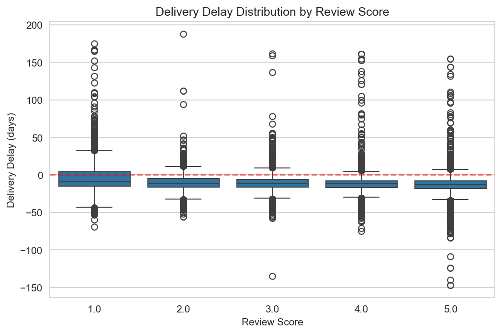
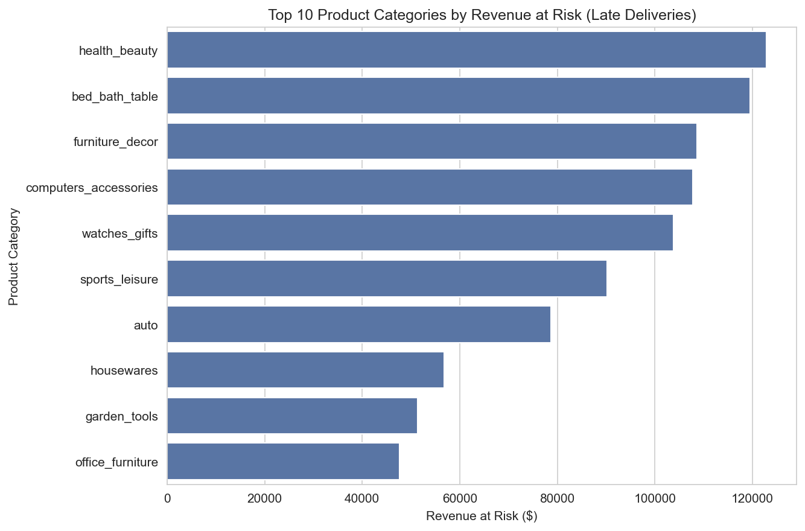
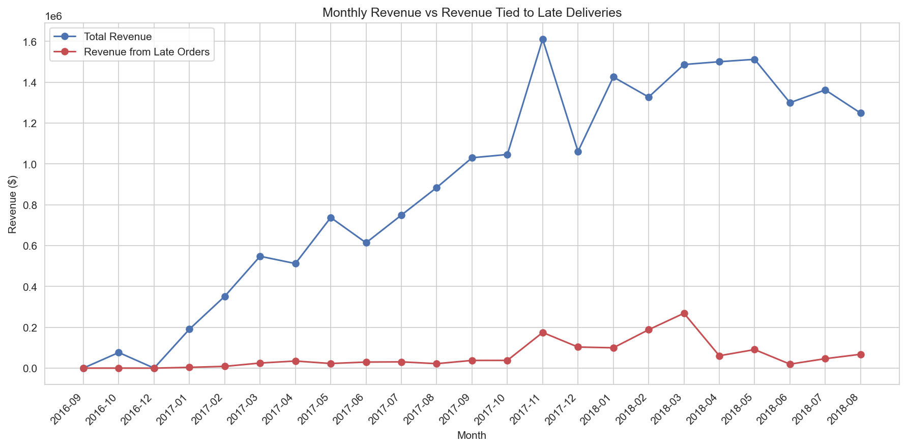

# Revenue Leakage Analysis — Olist E-Commerce

End-to-end data analysis project identifying revenue at risk from delivery delays and
customer dissatisfaction, using the Olist Brazilian E-Commerce dataset. Built with Python,
SQL, and Power BI.

## Business Problem

Olist is a marketplace connecting small Brazilian sellers to customers. This project answers:
**Which factors are driving customer dissatisfaction and revenue risk, and where should the
business focus to reduce it?**

## Dataset

[Brazilian E-Commerce Public Dataset by Olist](https://www.kaggle.com/datasets/olistbr/brazilian-ecommerce)
— ~99K orders (Sept 2016 – Oct 2018), including orders, payments, reviews, products, and
customer data.

## Tools Used

- **Python** (Pandas, NumPy) — data cleaning and merging
- **SQL** (SQLite) — business analysis queries
- **Matplotlib / Seaborn** — exploratory visualizations
- **Power BI** — interactive dashboard

## Key Findings

| Metric                      | Result                                                        |
| --------------------------- | ------------------------------------------------------------- |
| Late orders                 | 6.57% of all orders                                           |
| Review score gap            | 2.25 (late) vs 4.13 (on-time) — a 46% drop                   |
| Revenue tied to late orders | $1.37M                                                        |
| Top at-risk category        | Health & Beauty ($122.9K at risk)                             |
| Peak risk period            | November 2017 (Black Friday) — $174.7K in late-order revenue |

See [`reports/executive_summary.md`](reports/executive_summary.md) for the full write-up and
recommendations.

## Visuals

**Delivery delay distribution by review score**


**Top 10 categories by revenue at risk**


**Monthly revenue vs. revenue tied to late orders**


## Interactive Dashboard

Built in Power BI — see [`dashboard/revenue_leakage.pbix`](dashboard/revenue_leakage.pbix)
(open with Power BI Desktop, free download).

## Project Structure

```
revenue-leakage-analysis/
├── data/
│   ├── raw/              # Olist CSVs (not included — download from Kaggle link above)
│   └── cleaned/          # Generated by notebook, not included (large files)
├── notebooks/
│   ├── 01_data_cleaning.ipynb
│   └── 02_eda.ipynb
├── sql/
│   └── queries.sql
├── dashboard/
│   └── revenue_leakage.pbix
├── reports/
│   ├── executive_summary.md
│   └── chart1-3.png
└── README.md
```

## How to Reproduce

1. Download the dataset from the [Kaggle link above](https://www.kaggle.com/datasets/olistbr/brazilian-ecommerce)
   and place the CSVs in `data/raw/`
2. Install dependencies: `pip install pandas numpy matplotlib seaborn jupyter sqlalchemy`
3. Run `notebooks/01_data_cleaning.ipynb` to generate the cleaned dataset and SQLite database
4. Run `notebooks/02_eda.ipynb` to reproduce the charts
5. Run queries in `sql/queries.sql` against `data/cleaned/olist.db`
6. Open `dashboard/revenue_leakage.pbix` in Power BI Desktop to explore the interactive dashboard

## Notable Data Quality Decisions

- Orders with a null delivery date were **not dropped** — treated as a signal (order never
  delivered) rather than missing data
- Caught and fixed a duplicate-counting bug in the repeat-purchase-rate SQL query, caused by
  the item-level granularity of the merged table (see comments in `sql/queries.sql`)
- Product category names were translated from Portuguese to English using Olist's provided
  translation file for readability
